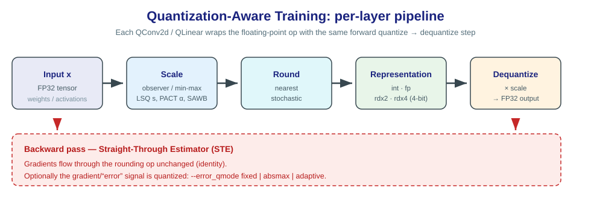
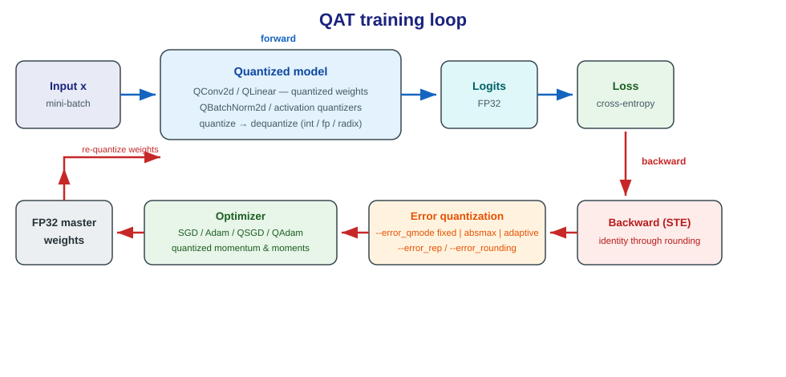
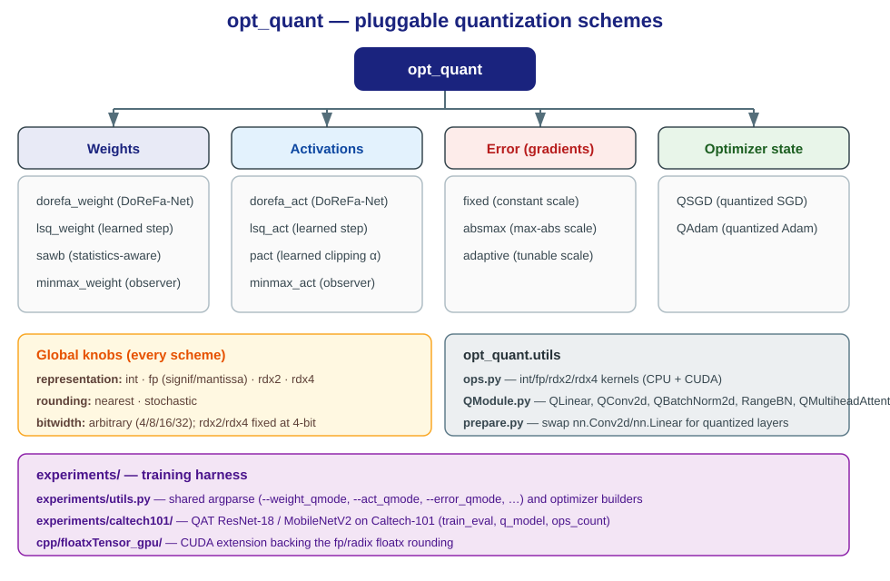

# PyTorch Quantization QAT Techniques

**State of Quantization Schemes in Deep Learning** — a research library (`opt_quant`) of pluggable
quantization-aware-training (QAT) schemes for PyTorch modules, with a CUDA extension and a
transfer-learning experiment harness.

The repository implements different QAT techniques as drop-in modules that can be injected into
`nn.Conv2d` / `nn.Linear` / batch-norm layers. Weights, activations, the backward gradient
("error") signal, and optimizer state can each be quantized independently.



---

## Table of contents

- [What is quantized](#what-is-quantized)
- [Supported techniques](#supported-techniques)
- [Repository layout](#repository-layout)
- [Installation](#installation)
- [Dataset](#dataset)
- [Quick start](#quick-start)
- [Command-line reference](#command-line-reference)
- [Quantized building blocks](#quantized-building-blocks)
- [CUDA extension](#cuda-extension)
- [Experiments](#experiments)
- [Known limitations](#known-limitations)
- [Acknowledgements](#acknowledgements)

---

## What is quantized

Every scheme derives from `opt_quant.schemes.QuantizeBase`, which exposes two global knobs shared by
all quantizers:

| Knob | Options | Meaning |
|---|---|---|
| **representation** | `int`, `fp`, `rdx2`, `rdx4` | Numeric format: two's-complement integer, IEEE-style float (significand/mantissa split), radix-2 or radix-4 log-domain. `rdx2`/`rdx4` are 4-bit only. |
| **rounding** | `nearest`, `stochastic` | Nearest rounding or unbiased stochastic rounding. |
| **bitwidth** | any integer | Default 32 (i.e. effectively no-op); typically 4/8/16. |

Four independent targets can be quantized:

1. **Weights** — `opt_quant/schemes/weight/`
2. **Activations** — `opt_quant/schemes/act/`
3. **Errors** (the backward gradient signal) — `opt_quant/schemes/error/`
4. **Optimizer state** (momentum / Adam moments) — `opt_quant/schemes/optim/`



Forward quantization uses the **straight-through estimator (STE)**: the quantize–dequantize op is
applied in the forward pass while its gradient is passed through unchanged, so the network trains
with full-precision master weights.

## Supported techniques

| Target | Scheme | Argument | Reference |
|---|---|---|---|
| Weight | DoReFa | `--weight_qmode dorefa_weight` | [DoReFa-Net](https://arxiv.org/abs/1606.06160) |
| Weight | LSQ | `--weight_qmode lsq_weight` | [Learned Step Size Quantization](https://arxiv.org/abs/1902.08153) |
| Weight | SAWB | `--weight_qmode sawb` | [SAWB / statistics-aware weight binning](https://arxiv.org/abs/1906.03161) |
| Weight | MinMax | `--weight_qmode minmax_weight` | observer-style min/max scaling |
| Activation | DoReFa | `--act_qmode dorefa_act` | DoReFa-Net |
| Activation | LSQ | `--act_qmode lsq_act` | LSQ |
| Activation | PACT | `--act_qmode pact` | [PACT](https://arxiv.org/abs/1805.06085) — learns the clipping parameter α |
| Activation | MinMax | `--act_qmode minmax_act` | moving-average min/max observer |
| Error / gradient | Fixed | `--error_qmode fixed` | constant scale |
| Error / gradient | AbsMax | `--error_qmode absmax` | per-tensor max-abs scaling |
| Error / gradient | Adaptive | `--error_qmode adaptive` | tunable scale updated from gradient sign |
| Optimizer | QSGD | `opt_quant.schemes.optim.QSGD` | quantized momentum buffer |
| Optimizer | QAdam | `opt_quant.schemes.optim.QAdam` | quantized Adam moments |

Representations and rounding are orthogonal: any scheme can be combined with `int`/`fp`/`rdx2`/`rdx4`
and `nearest`/`stochastic`.

## Repository layout

```
Pytorch-Quantization-QAT-Techniques/
├── opt_quant/                      # the library (installable package)
│   ├── schemes/
│   │   ├── quantize_base.py        # QuantizeBase — common interface
│   │   ├── weight/                 # dorefa.py, lsq.py, sawb.py, minmax.py
│   │   ├── act/                    # dorefa.py, lsq.py, pact.py, minmax.py
│   │   ├── error/                  # fixed.py, absmax.py, adaptive.py (gradient quantizers)
│   │   └── optim/                  # QSGD.py, QAdam.py
│   └── utils/
│       ├── ops.py                  # int/fp/rdx2/rdx4 quant kernels (CPU + CUDA)
│       ├── QModule.py              # QLinear, QConv2d, QBatchNorm2d, RangeBN, QMultiheadAttention
│       └── prepare.py              # replace nn layers with quantized layers
├── cpp/floatxTensor_gpu/           # pybind11 + CUDA extension for IEEE/floatx rounding
├── experiments/
│   ├── utils.py                    # shared CLI parser + optimizer/model builders
│   └── caltech101/                 # QAT ResNet-18 / MobileNetV2 on Caltech-101
│       ├── tl_train_eval.py        # training / evaluation entry point
│       ├── q_model.py              # quantized ResNet / MobileNet definitions
│       ├── ops_count.py            # FLOP / parameter accounting
│       └── utils2.py               # dataset loaders (Caltech-101 + others)
├── scripts/download_caltech101.py  # fetch the Caltech-101 dataset
├── setup.py                        # builds the CUDA/CPP extension
└── requirements.txt
```



## Installation

Requirements: **Python ≥ 3.6**, **PyTorch**, and (for GPU kernels) the **CUDA toolkit**.

```bash
# 1) Build the extension that rounds fp / radix representations.
#    Use `gpu` for a CUDA build or `cpu` for a CPU-only build.
python setup.py gpu install     # or: python setup.py cpu install

# 2) Install the Python package + dependencies.
pip install -r requirements.txt
pip install -e .
```

> The `gpu` build compiles `cpp/floatxTensor_gpu` into a `floatxTensor_gpu` module; `ops.py`
> automatically falls back to a CPU `floatxTensor` module when CUDA is unavailable.

`opt_quant.utils.QModule` contains a quantized multi-head attention implementation derived from
**fairseq** and imports it unconditionally, so `fairseq` is a hard dependency (it is listed in
`requirements.txt`).

## Dataset

The Caltech-101 images are **not** tracked by git (~137 MB). Download them with:

```bash
python scripts/download_caltech101.py
```

This extracts `101_ObjectCategories/` into `experiments/caltech101/`. The loader drops the
`BACKGROUND_Google` folder, leaving **101 classes**, and uses the same 3030/5647 train/test split as
*"How well do sparse ImageNet models transfer?"*.

## Quick start

Run the training entry point **from inside the experiment folder** (the data loader resolves
`./101_ObjectCategories` relative to the working directory):

```bash
cd experiments/caltech101
python tl_train_eval.py \
    --model resnet18 --dataset caltech101 \
    --epochs 150 --lr 0.01 --seed 4096 \
    --act_qmode dorefa_act  --act_bits 8    --act_rep int \
    --weight_qmode lsq_weight --weight_bits 8 --weight_rep int \
    --shortcut_quant False
```

Training logs to [Weights & Biases](https://wandb.ai) and writes the best checkpoint to
`./checkpoint/<wandb.run.name>/ckpt.pth`.

SLURM launchers are provided in `experiments/caltech101/`:
`run_tl_on_ault.sh`, `speedup_experiments_ault.sh`, `storage_experiments_ault.sh`, and the template
`job_ault.sbatch`.

## Command-line reference

The shared parser lives in `experiments/utils.py` (`quant_parser` / `quant_args_parser`). Key flags:

| Flag | Description |
|---|---|
| `--weight_qmode` | `lsq_weight`, `sawb`, `dorefa_weight`, `minmax_weight`, `none` |
| `--weight_rep` | `int`, `fp`, `rdx2`, `rdx4` |
| `--weight_bits` | weight bit width (default 32) |
| `--weight_rounding` | `nearest`, `stochastic` |
| `--act_qmode` | `lsq_act`, `pact`, `dorefa_act`, `minmax_act`, `none` |
| `--act_bits` / `--act_rep` / `--act_rounding` / `--act_mode` | activation quantization controls (`--act_mode signed|unsigned` for DoReFa) |
| `--pact_reg` | L2 regularization coefficient for PACT's α |
| `--error_qmode` | `adaptive`, `fixed`, `absmax`, `none` |
| `--error_rep` / `--error_rounding` / `--error_sig` / `--error_man` / `--error_scale` | gradient quantization controls (fp bit width is derived as `sig + man + 1`) |
| `--bn` | batch-norm type: `BN` or `RangeBN` |
| `--bn_*` | the same weight/act/error flags for batch-norm modules |
| `--first_*` | quantization flags for the first layer |
| `--last_layer_quant` | quantize the classifier / last layer |
| `--shortcut_quant` | quantize residual shortcut connections |
| `--optim_qmode` | `None` or `bnb` (bitsandbytes 8-bit optimizer) |
| `--weight_sig` / `--weight_man` | significand / mantissa split for `fp` representation |

Run `python tl_train_eval.py --help` for the full list.

## Quantized building blocks

`opt_quant.utils.QModule` provides the layer replacements used by the experiment models:

- `QLinear`, `QConv2d` — linear/conv layers with quantized weights and activations.
- `QBatchNorm2d`, `RangeBN` — quantized batch normalization.
- `QLayerNorm`, `UniformQuantize`, `UniformQuantizeGrad`, `QuantMeasure` — quantization helpers.
- `QMultiheadAttention` — quantization-aware multi-head attention (adapted from fairseq).

`opt_quant.utils.prepare.model_prepare` can rewrite an existing model in place, replacing
`nn.Conv2d` / `nn.Linear` with their quantized counterparts based on the parsed arguments.

## CUDA extension

`cpp/floatxTensor_gpu/` implements per-element IEEE-style float quantization:

- `main.cpp` — pybind11 bindings: `makeTensor` (CPU/OpenMP) and `makeTensor_cuda` (CUDA).
- `cuda_kernels.cu` — the CUDA rounding kernel.
- `floatx.hpp` — third-party OPRECOMP floatx header (Apache-2.0).

`opt_quant/utils/ops.py` binds `makeTensor_cuda` as `ieee_quant` when CUDA is available, otherwise
`makeTensor`.

## Experiments

The `experiments/caltech101/` folder contains a transfer-learning QAT study:

- `tl_train_eval.py` — trains ResNet-18 / MobileNetV2 with configurable quantization schemes,
  tracks metrics in W&B, and saves the best checkpoint.
- `q_model.py` — quantized ResNet-18, MobileNetV2 and an (incomplete) ResNet-50.
- `ops_count.py` — registers forward/backward hooks to count parameters and (weight×activation,
  weight×error, activation×error) multiply-accumulate ops per layer, exporting a CSV/pickle.
- `utils2.py` — data loaders for Caltech-101 and several other image datasets.

## Known limitations

- **ResNet-50** is a stub: the training branch prints `next step TODO` and exits; use `resnet18` or
  `mobilenet`.
- **`fp` + `stochastic` rounding** is not implemented (`fp_stochastic_quant` in `ops.py` is a no-op).
- The committed `build/`, `dist/`, `opt_quant.egg-info/`, `__pycache__/` and `.ipynb_checkpoints/`
  folders are stale build artifacts from the original environment.
- Some supervision scripts contain hard-coded cluster account/paths (`mhussein`,
  `/users/mhussein/...`) and should be adapted to your environment.

## Acknowledgements

- `QModule.py`'s multi-head attention is adapted from
  [fairseq](https://github.com/facebookresearch/fairseq) (MIT License).
- `cpp/floatxTensor_gpu/floatx.hpp` is part of the
  [OPRECOMP](https://oprecomp.github.io/) project (Apache-2.0).
- Caltech-101 is distributed by Caltech under
  [CC BY 4.0](https://creativecommons.org/licenses/by/4.0/).
